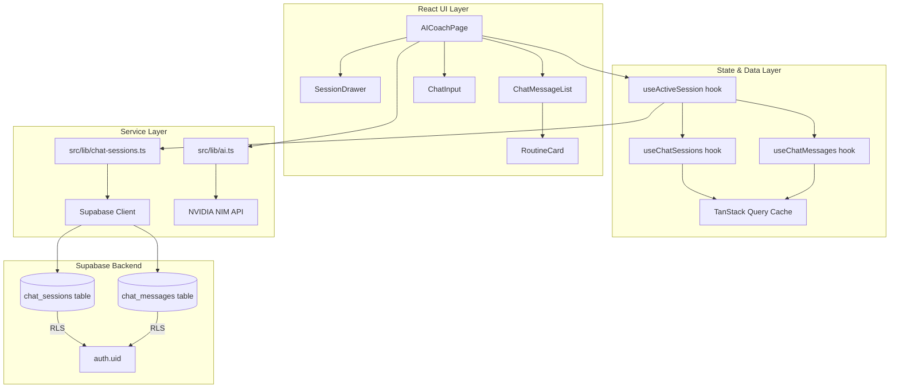

# Design Document: AI Chat Sessions

## Overview

This design upgrades the existing single-conversation AI Coach into a full multi-session chat system with persistence, context windowing, and a session management drawer. The architecture introduces two new Supabase tables (`chat_sessions`, `chat_messages`), a TanStack Query data layer for client-side caching, and a refactored `AICoachPage` that manages session state.

The key design decisions:
1. **Supabase-first persistence** — sessions and messages are stored server-side with RLS, not in localStorage. This gives cross-device access and security for free.
2. **Context window at the API call boundary** — all messages are persisted, but only the 20 most recent are sent to the NVIDIA NIM API. This keeps costs predictable and responses fast.
3. **Session drawer pattern** — a full-screen bottom drawer (sheet) on mobile displays the session list, matching the app's existing glassmorphism aesthetic and mobile-first design.
4. **Optimistic UI** — messages appear instantly in the chat; persistence happens asynchronously with retry on failure.

## Architecture



### Data Flow

1. User opens AI Coach → `useActiveSession` checks for existing sessions → creates one if none exist
2. User sends message → message appended optimistically to UI → persisted to `chat_messages` → AI request sent with last 20 messages → response persisted → UI updated
3. User opens session drawer → `useChatSessions` fetches all sessions ordered by `updated_at` desc
4. User switches session → `useChatMessages` loads messages for selected session → UI re-renders

## Components and Interfaces

### New Files

| File | Purpose |
|------|---------|
| `src/lib/chat-sessions.ts` | Supabase CRUD functions for sessions and messages |
| `src/hooks/useChatSessions.ts` | TanStack Query hooks for session list, messages, mutations |
| `src/components/chat/SessionDrawer.tsx` | Full-screen drawer with session list |
| `src/components/chat/ChatBubble.tsx` | Individual message bubble (extracted from page) |
| `supabase/migrations/00004_chat_sessions.sql` | Database migration |

### Modified Files

| File | Changes |
|------|---------|
| `src/pages/AICoachPage.tsx` | Refactored to use session hooks, add drawer toggle button |
| `src/lib/ai.ts` | Add context window slicing utility |
| `src/types/database.ts` | Add `chat_sessions` and `chat_messages` table types |

### Key Interfaces

```typescript
// src/lib/chat-sessions.ts

export interface ChatSession {
  id: string;
  user_id: string;
  title: string;
  created_at: string;
  updated_at: string;
}

export interface ChatMessage {
  id: string;
  session_id: string;
  role: 'user' | 'assistant';
  content: string;
  routine_json: GeneratedRoutine | null;
  routine_saved: boolean;
  saved_routine_id: string | null;
  created_at: string;
}

export interface CreateSessionInput {
  title?: string; // defaults to "New Chat"
}

export interface CreateMessageInput {
  session_id: string;
  role: 'user' | 'assistant';
  content: string;
  routine_json?: GeneratedRoutine | null;
}
```

### Hook API

```typescript
// src/hooks/useChatSessions.ts

// Fetches all sessions for the current user, ordered by updated_at desc
function useChatSessions(): UseQueryResult<ChatSession[]>

// Fetches all messages for a given session
function useChatMessages(sessionId: string | null): UseQueryResult<ChatMessage[]>

// Creates a new session, returns the created session
function useCreateSession(): UseMutationResult<ChatSession, Error, CreateSessionInput>

// Deletes a session and its messages (cascade)
function useDeleteSession(): UseMutationResult<void, Error, string>

// Sends a user message: persists it, calls AI, persists response
function useSendMessage(): UseMutationResult<ChatMessage, Error, {sessionId: string, content: string}>

// Updates session title
function useUpdateSessionTitle(): UseMutationResult<void, Error, {id: string, title: string}>
```

### Context Window Utility

```typescript
// Added to src/lib/ai.ts

const CONTEXT_WINDOW_SIZE = 20;

export function buildContextMessages(
  messages: ChatMessage[],
  systemPrompt: string
): AIMessage[] {
  const recent = messages.slice(-CONTEXT_WINDOW_SIZE);
  return [
    { role: 'system', content: systemPrompt },
    ...recent.map(m => ({ role: m.role, content: m.content })),
  ];
}
```

### Session Drawer Component

The `SessionDrawer` renders as a full-screen overlay on mobile (iPhone 13 Pro viewport) with:
- Backdrop blur overlay, dismissible by tap-outside or swipe-down
- Session list items showing title + relative time ("2h ago", "Yesterday")
- Swipe-left to reveal delete button on each session entry
- "New Chat" button at the top
- Uses `framer-motion` or CSS transitions for slide-up animation (CSS-only preferred to avoid new dependency)

### Title Generation

When the user sends the first message in a session, the title is updated:
```typescript
function generateSessionTitle(firstMessage: string): string {
  return firstMessage.length > 50
    ? firstMessage.slice(0, 47) + '...'
    : firstMessage;
}
```

This is a synchronous, client-side truncation — no AI call needed for title generation.

## Data Models

### Database Schema (Migration)

```sql
-- chat_sessions: AI coach conversation sessions
CREATE TABLE chat_sessions (
  id uuid PRIMARY KEY DEFAULT gen_random_uuid(),
  user_id uuid NOT NULL REFERENCES profiles(id) ON DELETE CASCADE,
  title text NOT NULL DEFAULT 'New Chat',
  created_at timestamptz NOT NULL DEFAULT now(),
  updated_at timestamptz NOT NULL DEFAULT now()
);

-- chat_messages: messages within a chat session
CREATE TABLE chat_messages (
  id uuid PRIMARY KEY DEFAULT gen_random_uuid(),
  session_id uuid NOT NULL REFERENCES chat_sessions(id) ON DELETE CASCADE,
  role text NOT NULL CHECK (role IN ('user', 'assistant')),
  content text NOT NULL,
  routine_json jsonb,
  routine_saved boolean NOT NULL DEFAULT false,
  saved_routine_id uuid REFERENCES routines(id) ON DELETE SET NULL,
  created_at timestamptz NOT NULL DEFAULT now()
);

-- Indexes
CREATE INDEX idx_chat_sessions_user_id ON chat_sessions(user_id);
CREATE INDEX idx_chat_sessions_updated_at ON chat_sessions(updated_at DESC);
CREATE INDEX idx_chat_messages_session_id ON chat_messages(session_id);
CREATE INDEX idx_chat_messages_created_at ON chat_messages(created_at);

-- Triggers
CREATE TRIGGER chat_sessions_updated_at
  BEFORE UPDATE ON chat_sessions
  FOR EACH ROW
  EXECUTE FUNCTION update_updated_at();

-- Enable RLS
ALTER TABLE chat_sessions ENABLE ROW LEVEL SECURITY;
ALTER TABLE chat_messages ENABLE ROW LEVEL SECURITY;

-- RLS Policies: chat_sessions
CREATE POLICY "Users can view own sessions"
  ON chat_sessions FOR SELECT
  USING (auth.uid() = user_id);

CREATE POLICY "Users can create own sessions"
  ON chat_sessions FOR INSERT
  WITH CHECK (auth.uid() = user_id);

CREATE POLICY "Users can update own sessions"
  ON chat_sessions FOR UPDATE
  USING (auth.uid() = user_id);

CREATE POLICY "Users can delete own sessions"
  ON chat_sessions FOR DELETE
  USING (auth.uid() = user_id);

-- RLS Policies: chat_messages
CREATE POLICY "Users can view own messages"
  ON chat_messages FOR SELECT
  USING (
    EXISTS (
      SELECT 1 FROM chat_sessions
      WHERE chat_sessions.id = chat_messages.session_id
        AND chat_sessions.user_id = auth.uid()
    )
  );

CREATE POLICY "Users can insert own messages"
  ON chat_messages FOR INSERT
  WITH CHECK (
    EXISTS (
      SELECT 1 FROM chat_sessions
      WHERE chat_sessions.id = chat_messages.session_id
        AND chat_sessions.user_id = auth.uid()
    )
  );

CREATE POLICY "Users can update own messages"
  ON chat_messages FOR UPDATE
  USING (
    EXISTS (
      SELECT 1 FROM chat_sessions
      WHERE chat_sessions.id = chat_messages.session_id
        AND chat_sessions.user_id = auth.uid()
    )
  );

CREATE POLICY "Users can delete own messages"
  ON chat_messages FOR DELETE
  USING (
    EXISTS (
      SELECT 1 FROM chat_sessions
      WHERE chat_sessions.id = chat_messages.session_id
        AND chat_sessions.user_id = auth.uid()
    )
  );
```

### TypeScript Types (added to database.ts)

```typescript
chat_sessions: {
  Row: {
    id: string;
    user_id: string;
    title: string;
    created_at: string;
    updated_at: string;
  };
  Insert: {
    id?: string;
    user_id: string;
    title?: string;
    created_at?: string;
    updated_at?: string;
  };
  Update: {
    id?: string;
    user_id?: string;
    title?: string;
    created_at?: string;
    updated_at?: string;
  };
};
chat_messages: {
  Row: {
    id: string;
    session_id: string;
    role: string;
    content: string;
    routine_json: Json | null;
    routine_saved: boolean;
    saved_routine_id: string | null;
    created_at: string;
  };
  Insert: {
    id?: string;
    session_id: string;
    role: string;
    content: string;
    routine_json?: Json | null;
    routine_saved?: boolean;
    saved_routine_id?: string | null;
    created_at?: string;
  };
  Update: {
    id?: string;
    session_id?: string;
    role?: string;
    content?: string;
    routine_json?: Json | null;
    routine_saved?: boolean;
    saved_routine_id?: string | null;
    created_at?: string;
  };
};
```


## Correctness Properties

*A property is a characteristic or behavior that should hold true across all valid executions of a system — essentially, a formal statement about what the system should do. Properties serve as the bridge between human-readable specifications and machine-verifiable correctness guarantees.*

### Property 1: Title generation respects length bound

*For any* string input to `generateSessionTitle`, the output SHALL have length ≤ 50 characters and SHALL be a prefix of the original string (possibly with "..." appended when truncated).

**Validates: Requirements 1.3**

### Property 2: Session list is sorted by recency

*For any* list of chat sessions returned by `useChatSessions`, the sessions SHALL be ordered by `updated_at` in descending order — i.e., for every consecutive pair (sessions[i], sessions[i+1]), sessions[i].updated_at >= sessions[i+1].updated_at.

**Validates: Requirements 3.1**

### Property 3: Relative time produces valid human-readable output

*For any* timestamp in the past (between epoch and now), the relative time formatting function SHALL return a non-empty string matching one of the expected patterns (e.g., "Xm ago", "Xh ago", "Yesterday", date string).

**Validates: Requirements 3.3**

### Property 4: Context window takes at most 20 messages from the tail in order

*For any* array of chat messages, `buildContextMessages` SHALL return a user/assistant message list of length min(messages.length, 20), taken from the last 20 elements of the input array, preserving their original chronological order.

**Validates: Requirements 5.1, 5.2**

### Property 5: System prompt is always the first message

*For any* array of chat messages (including empty), `buildContextMessages` SHALL always return a result where the first element has role "system" and content equal to the provided system prompt string.

**Validates: Requirements 5.3**

## Error Handling

| Scenario | Handling Strategy |
|----------|------------------|
| Message fails to persist | Show inline error indicator (red dot) on the message bubble. Retry on next user action (send/navigate). Use TanStack Query's `onError` callback. |
| Session creation fails | Show toast notification. Retry automatically once. If still failing, show "Tap to retry" in the empty state. |
| Session list fetch fails | Show error state in drawer with "Tap to retry" button. Use TanStack Query's `retry: 2` config. |
| Messages fetch fails on session switch | Show error state in chat area with retry option. Keep previous session visible until new one loads successfully. |
| AI API request fails | Show error message bubble (existing pattern). Do NOT persist the error as a chat_message. |
| Network offline | TanStack Query's `networkMode: 'offlineFirst'` will queue mutations. Messages show pending state. Sync on reconnect. |
| Delete fails | Revert optimistic removal of session from list. Show toast with error. |
| RLS violation (shouldn't happen in normal use) | Supabase returns 403 — treat as auth error, redirect to login. |

### Retry Strategy

- Message persistence: Retry 1x immediately, then mark as failed with error indicator
- Session CRUD: TanStack Query default retry (3 attempts with exponential backoff)
- AI API calls: No automatic retry (user must re-send message)

## Testing Strategy

### Unit Tests (Example-Based)

| Test | Validates |
|------|-----------|
| Creating a session returns default title "New Chat" | Req 1.1 |
| Active session changes on creation | Req 1.2 |
| Error indicator appears on failed persist | Req 2.4 |
| Session selection loads correct messages | Req 3.2 |
| Drawer renders as full-screen on mobile | Req 3.4 |
| Swipe-left reveals delete button | Req 4.1 |
| Deleting active session creates new one | Req 4.3 |
| Context window doesn't delete stored messages | Req 5.4 |
| RoutineCard shows "Save Routine" when unsaved | Req 7.1 |
| RoutineCard shows "Start Workout" when saved | Req 7.3 |
| Empty state auto-creates session | Req 8.1 |
| Welcome message not persisted to DB | Req 8.2 |

### Property-Based Tests

Property-based tests use **fast-check** (the standard PBT library for TypeScript/JavaScript).

Each property test runs a minimum of **100 iterations** with generated inputs.

| Property Test | Tag |
|---------------|-----|
| Title generation length bound | Feature: ai-chat-sessions, Property 1: Title generation respects length bound |
| Session list sort invariant | Feature: ai-chat-sessions, Property 2: Session list is sorted by recency |
| Relative time format validity | Feature: ai-chat-sessions, Property 3: Relative time produces valid human-readable output |
| Context window tail + max size | Feature: ai-chat-sessions, Property 4: Context window takes at most 20 messages from the tail in order |
| System prompt always first | Feature: ai-chat-sessions, Property 5: System prompt is always the first message |

### Integration Tests

| Test | Validates |
|------|-----------|
| Message persists with correct role/content | Req 2.1, 2.2 |
| Messages reload on navigation return | Req 2.3 |
| Cascade delete removes session + messages | Req 4.2 |
| RLS blocks cross-user session access | Req 6.1, 6.2, 6.3 |
| Routine save updates message state | Req 7.2 |

### Test Configuration

```bash
# Install fast-check for property-based testing
npm install --save-dev fast-check vitest @testing-library/react
```

Each property test is configured with:
```typescript
fc.assert(
  fc.property(/* arbitraries */, (input) => {
    // property assertion
  }),
  { numRuns: 100 }
);
```
