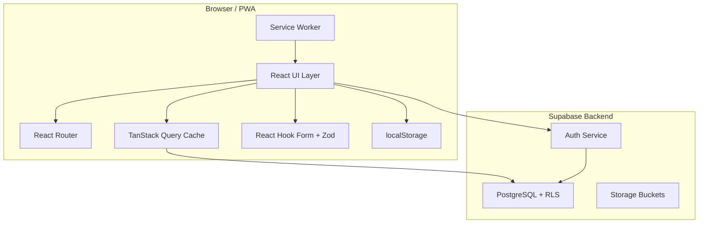
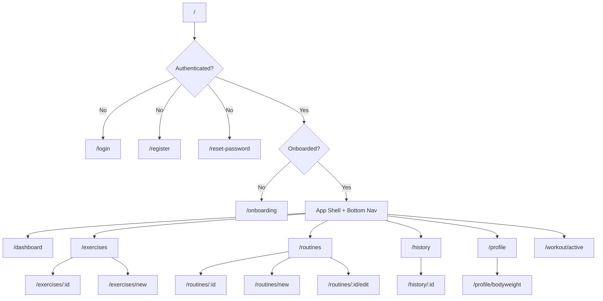
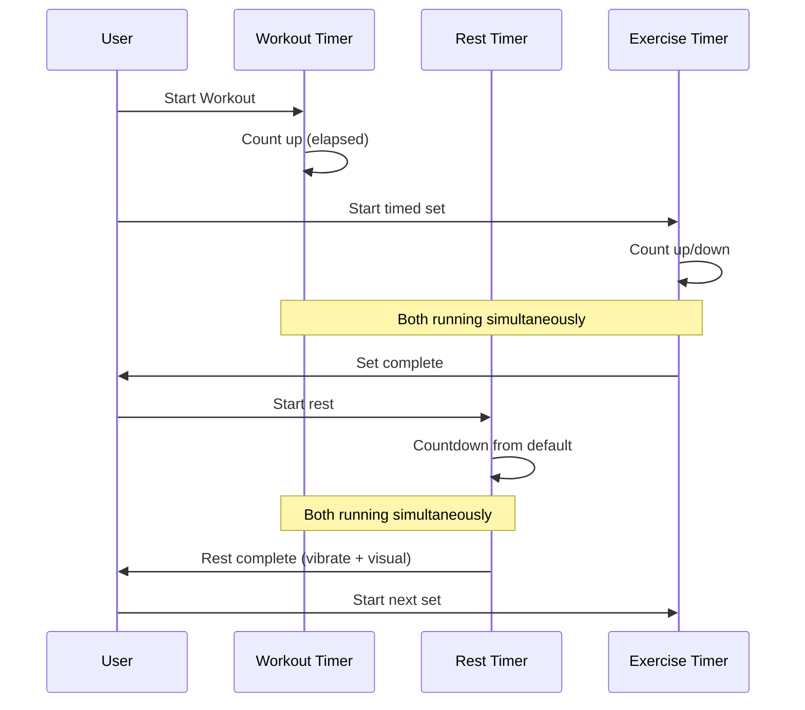
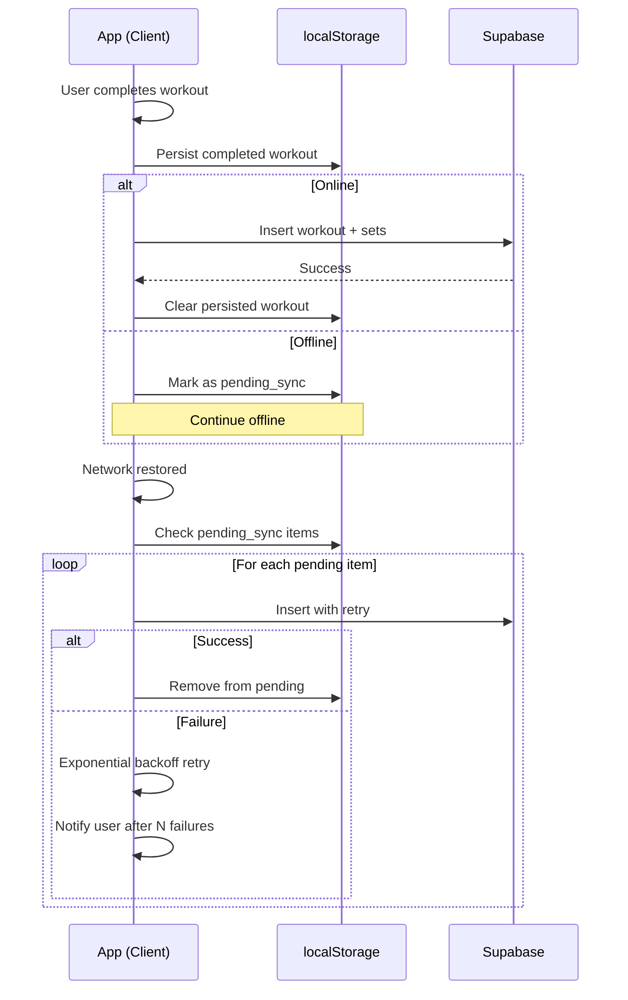
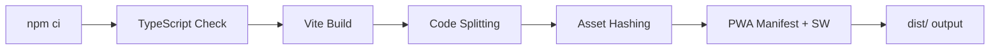

# Design Document: Calisthenics Log

## Overview

Calisthenics Log is a mobile-first progressive web application for tracking calisthenics workouts. The system uses a React + TypeScript frontend with Vite as the build tool, Tailwind CSS for styling, and Supabase as the backend (PostgreSQL, authentication, Row-Level Security, and storage). The application supports five exercise types (bodyweight, weighted, assisted, duration, static_hold), three independent timer systems, offline persistence via localStorage, and cloud sync via Supabase. The architecture prioritizes fast, one-handed interaction during active training sessions.

The frontend leverages TanStack Query for server state management, React Hook Form + Zod for form validation, and React Router for navigation. The PWA is hosted on Render as a static site with service worker caching for offline app shell access.

## Architecture



## Database Schema

### Entity Relationship Diagram

```mermaid
erDiagram
    profiles ||--o{ exercises : creates
    profiles ||--o{ routines : owns
    profiles ||--o{ workouts : logs
    profiles ||--o{ bodyweight_entries : records
    exercises ||--o{ routine_exercises : included_in
    exercises ||--o{ workout_exercises : performed_in
    exercises ||--o{ exercise_sets : has
    exercises ||--o{ personal_records : achieves
    routines ||--o{ routine_exercises : contains
    workouts ||--o{ workout_exercises : contains
    workout_exercises ||--o{ exercise_sets : contains

    profiles {
        uuid id PK
        text display_name
        text unit_preference
        integer default_rest_seconds
        boolean onboarding_complete
        timestamptz created_at
        timestamptz updated_at
    }

    exercises {
        uuid id PK
        uuid user_id FK
        text name
        text exercise_type
        text[] muscle_groups
        text instructions
        uuid progresses_to FK
        boolean is_system
        timestamptz created_at
    }

    routines {
        uuid id PK
        uuid user_id FK
        text name
        integer position
        timestamptz created_at
        timestamptz updated_at
    }

    routine_exercises {
        uuid id PK
        uuid routine_id FK
        uuid exercise_id FK
        integer position
        integer target_sets
        integer target_reps
        numeric target_weight_kg
        integer target_duration_seconds
        integer rest_seconds
    }

    workouts {
        uuid id PK
        uuid user_id FK
        uuid routine_id FK
        text name
        timestamptz started_at
        timestamptz completed_at
        integer duration_seconds
        text notes
    }

    workout_exercises {
        uuid id PK
        uuid workout_id FK
        uuid exercise_id FK
        integer position
        integer rest_seconds
    }

    exercise_sets {
        uuid id PK
        uuid workout_exercise_id FK
        integer set_number
        integer reps
        numeric weight_kg
        integer duration_seconds
        numeric rpe
        integer rir
        boolean completed
        timestamptz completed_at
    }

    personal_records {
        uuid id PK
        uuid user_id FK
        uuid exercise_id FK
        text record_type
        numeric value
        uuid workout_id FK
        timestamptz achieved_at
    }

    bodyweight_entries {
        uuid id PK
        uuid user_id FK
        numeric weight_kg
        date entry_date
        timestamptz created_at
    }
}
```

### Table Definitions

#### `profiles`
Extends Supabase `auth.users`. Created via trigger on user signup.

| Column | Type | Constraints |
|--------|------|-------------|
| id | uuid | PK, references auth.users(id) |
| display_name | text | nullable |
| unit_preference | text | NOT NULL, CHECK IN ('metric', 'imperial'), DEFAULT 'metric' |
| default_rest_seconds | integer | NOT NULL, DEFAULT 90 |
| onboarding_complete | boolean | NOT NULL, DEFAULT false |
| created_at | timestamptz | NOT NULL, DEFAULT now() |
| updated_at | timestamptz | NOT NULL, DEFAULT now() |

#### `exercises`
System-default and user-created exercises.

| Column | Type | Constraints |
|--------|------|-------------|
| id | uuid | PK, DEFAULT gen_random_uuid() |
| user_id | uuid | FK → profiles(id), nullable (null = system exercise) |
| name | text | NOT NULL |
| exercise_type | text | NOT NULL, CHECK IN ('bodyweight','weighted','assisted','duration','static_hold') |
| muscle_groups | text[] | DEFAULT '{}' |
| instructions | text | nullable |
| progresses_to | uuid | FK → exercises(id), nullable |
| is_system | boolean | NOT NULL, DEFAULT false |
| created_at | timestamptz | NOT NULL, DEFAULT now() |

Unique constraint: `UNIQUE(user_id, name)` for custom exercises.

#### `routines`
Workout templates.

| Column | Type | Constraints |
|--------|------|-------------|
| id | uuid | PK, DEFAULT gen_random_uuid() |
| user_id | uuid | FK → profiles(id), NOT NULL |
| name | text | NOT NULL |
| position | integer | NOT NULL, DEFAULT 0 |
| created_at | timestamptz | NOT NULL, DEFAULT now() |
| updated_at | timestamptz | NOT NULL, DEFAULT now() |

#### `routine_exercises`
Exercises within a routine template.

| Column | Type | Constraints |
|--------|------|-------------|
| id | uuid | PK, DEFAULT gen_random_uuid() |
| routine_id | uuid | FK → routines(id) ON DELETE CASCADE, NOT NULL |
| exercise_id | uuid | FK → exercises(id), NOT NULL |
| position | integer | NOT NULL |
| target_sets | integer | DEFAULT 3 |
| target_reps | integer | nullable |
| target_weight_kg | numeric(7,2) | nullable |
| target_duration_seconds | integer | nullable |
| rest_seconds | integer | nullable (null = use global default) |

#### `workouts`
Completed workout sessions.

| Column | Type | Constraints |
|--------|------|-------------|
| id | uuid | PK, DEFAULT gen_random_uuid() |
| user_id | uuid | FK → profiles(id), NOT NULL |
| routine_id | uuid | FK → routines(id), nullable |
| name | text | NOT NULL |
| started_at | timestamptz | NOT NULL |
| completed_at | timestamptz | nullable |
| duration_seconds | integer | nullable |
| notes | text | nullable |

#### `workout_exercises`
Exercises performed within a workout session.

| Column | Type | Constraints |
|--------|------|-------------|
| id | uuid | PK, DEFAULT gen_random_uuid() |
| workout_id | uuid | FK → workouts(id) ON DELETE CASCADE, NOT NULL |
| exercise_id | uuid | FK → exercises(id), NOT NULL |
| position | integer | NOT NULL |
| rest_seconds | integer | nullable |

#### `exercise_sets`
Individual sets within a workout exercise.

| Column | Type | Constraints |
|--------|------|-------------|
| id | uuid | PK, DEFAULT gen_random_uuid() |
| workout_exercise_id | uuid | FK → workout_exercises(id) ON DELETE CASCADE, NOT NULL |
| set_number | integer | NOT NULL |
| reps | integer | nullable |
| weight_kg | numeric(7,2) | nullable |
| duration_seconds | integer | nullable |
| rpe | numeric(3,1) | nullable, CHECK (rpe >= 1 AND rpe <= 10) |
| rir | integer | nullable, CHECK (rir >= 0 AND rir <= 5) |
| completed | boolean | NOT NULL, DEFAULT false |
| completed_at | timestamptz | nullable |

#### `personal_records`
Best performances per exercise per metric.

| Column | Type | Constraints |
|--------|------|-------------|
| id | uuid | PK, DEFAULT gen_random_uuid() |
| user_id | uuid | FK → profiles(id), NOT NULL |
| exercise_id | uuid | FK → exercises(id), NOT NULL |
| record_type | text | NOT NULL, CHECK IN ('max_reps','max_weight','max_volume','longest_hold') |
| value | numeric | NOT NULL |
| workout_id | uuid | FK → workouts(id), nullable |
| achieved_at | timestamptz | NOT NULL, DEFAULT now() |

Unique constraint: `UNIQUE(user_id, exercise_id, record_type)`

#### `bodyweight_entries`
User bodyweight log.

| Column | Type | Constraints |
|--------|------|-------------|
| id | uuid | PK, DEFAULT gen_random_uuid() |
| user_id | uuid | FK → profiles(id), NOT NULL |
| weight_kg | numeric(5,2) | NOT NULL |
| entry_date | date | NOT NULL, DEFAULT CURRENT_DATE |
| created_at | timestamptz | NOT NULL, DEFAULT now() |

Unique constraint: `UNIQUE(user_id, entry_date)`

## Row-Level Security Policies

All tables enforce user isolation. System exercises are readable by all authenticated users.

```sql
-- profiles: users can only read/update their own profile
CREATE POLICY "Users read own profile" ON profiles
  FOR SELECT USING (auth.uid() = id);
CREATE POLICY "Users update own profile" ON profiles
  FOR UPDATE USING (auth.uid() = id);

-- exercises: users see system exercises + their own
CREATE POLICY "Users read exercises" ON exercises
  FOR SELECT USING (is_system = true OR auth.uid() = user_id);
CREATE POLICY "Users manage own exercises" ON exercises
  FOR ALL USING (auth.uid() = user_id);

-- routines: users manage their own routines
CREATE POLICY "Users manage own routines" ON routines
  FOR ALL USING (auth.uid() = user_id);

-- routine_exercises: via routine ownership
CREATE POLICY "Users manage own routine exercises" ON routine_exercises
  FOR ALL USING (
    EXISTS (SELECT 1 FROM routines WHERE routines.id = routine_id AND routines.user_id = auth.uid())
  );

-- workouts: users manage their own workouts
CREATE POLICY "Users manage own workouts" ON workouts
  FOR ALL USING (auth.uid() = user_id);

-- workout_exercises: via workout ownership
CREATE POLICY "Users manage own workout exercises" ON workout_exercises
  FOR ALL USING (
    EXISTS (SELECT 1 FROM workouts WHERE workouts.id = workout_id AND workouts.user_id = auth.uid())
  );

-- exercise_sets: via workout exercise → workout ownership
CREATE POLICY "Users manage own exercise sets" ON exercise_sets
  FOR ALL USING (
    EXISTS (
      SELECT 1 FROM workout_exercises we
      JOIN workouts w ON w.id = we.workout_id
      WHERE we.id = workout_exercise_id AND w.user_id = auth.uid()
    )
  );

-- personal_records: users manage their own records
CREATE POLICY "Users manage own records" ON personal_records
  FOR ALL USING (auth.uid() = user_id);

-- bodyweight_entries: users manage their own entries
CREATE POLICY "Users manage own bodyweight" ON bodyweight_entries
  FOR ALL USING (auth.uid() = user_id);
```

## API / Data Access Layer

### Supabase Client Setup

```typescript
// src/lib/supabase.ts
import { createClient } from '@supabase/supabase-js';
import type { Database } from '@/types/database';

export const supabase = createClient<Database>(
  import.meta.env.VITE_SUPABASE_URL,
  import.meta.env.VITE_SUPABASE_ANON_KEY
);
```

### TanStack Query Hook Patterns

```typescript
// src/hooks/useExercises.ts
import { useQuery, useMutation, useQueryClient } from '@tanstack/react-query';
import { supabase } from '@/lib/supabase';
import type { Exercise, CreateExerciseInput } from '@/types';

export function useExercises(filters?: { type?: string; muscleGroup?: string; search?: string }) {
  return useQuery({
    queryKey: ['exercises', filters],
    queryFn: async () => {
      let query = supabase.from('exercises').select('*');
      if (filters?.type) query = query.eq('exercise_type', filters.type);
      if (filters?.muscleGroup) query = query.contains('muscle_groups', [filters.muscleGroup]);
      if (filters?.search) query = query.ilike('name', `%${filters.search}%`);
      const { data, error } = await query.order('name');
      if (error) throw error;
      return data;
    },
  });
}

export function useCreateExercise() {
  const queryClient = useQueryClient();
  return useMutation({
    mutationFn: async (input: CreateExerciseInput) => {
      const { data, error } = await supabase.from('exercises').insert(input).select().single();
      if (error) throw error;
      return data;
    },
    onSuccess: () => queryClient.invalidateQueries({ queryKey: ['exercises'] }),
  });
}
```

### Key Query Hooks

| Hook | Query Key | Description |
|------|-----------|-------------|
| `useProfile()` | `['profile']` | Current user's profile |
| `useExercises(filters)` | `['exercises', filters]` | Exercise library with filtering |
| `useExercise(id)` | `['exercises', id]` | Single exercise with progression chain |
| `useRoutines()` | `['routines']` | All user routines |
| `useRoutine(id)` | `['routines', id]` | Single routine with exercises |
| `useWorkouts(params)` | `['workouts', params]` | Workout history (paginated) |
| `useWorkout(id)` | `['workouts', id]` | Full workout detail |
| `usePersonalRecords(exerciseId)` | `['records', exerciseId]` | PRs for an exercise |
| `useBodyweightEntries()` | `['bodyweight']` | Bodyweight log |

### Mutation Hooks

| Hook | Invalidates | Description |
|------|-------------|-------------|
| `useCreateExercise()` | `['exercises']` | Create custom exercise |
| `useCreateRoutine()` | `['routines']` | Create routine |
| `useUpdateRoutine()` | `['routines']` | Edit routine |
| `useDeleteRoutine()` | `['routines']` | Delete routine |
| `useSaveWorkout()` | `['workouts', 'records']` | Save completed workout + check PRs |
| `useLogBodyweight()` | `['bodyweight']` | Add bodyweight entry |
| `useUpdateProfile()` | `['profile']` | Update user profile/preferences |

## Components and Interfaces

### AuthProvider

```typescript
interface AuthContextValue {
  user: User | null;
  session: Session | null;
  loading: boolean;
  signIn: (email: string, password: string) => Promise<void>;
  signUp: (email: string, password: string) => Promise<void>;
  signInWithGoogle: () => Promise<void>;
  signOut: () => Promise<void>;
  resetPassword: (email: string) => Promise<void>;
}
```

**Responsibilities**:
- Manage Supabase auth session lifecycle
- Provide auth state to entire app via React Context
- Handle token refresh and session persistence

### ActiveWorkoutProvider

```typescript
interface ActiveWorkoutContextValue {
  workout: ActiveWorkout | null;
  startWorkout: (fromRoutine?: Routine) => void;
  addExercise: (exercise: Exercise) => void;
  removeExercise: (exerciseId: string) => void;
  reorderExercises: (fromIndex: number, toIndex: number) => void;
  addSet: (exerciseId: string) => void;
  updateSet: (exerciseId: string, setId: string, data: Partial<ActiveSet>) => void;
  completeSet: (exerciseId: string, setId: string) => void;
  finishWorkout: () => Promise<void>;
  discardWorkout: () => void;
  pauseWorkout: () => void;
  resumeWorkout: () => void;
}
```

**Responsibilities**:
- Manage in-progress workout state
- Persist state to localStorage on every change
- Coordinate with sync layer on workout completion

### Timer Hook

```typescript
interface TimerConfig {
  mode: 'countup' | 'countdown';
  initialSeconds?: number;
  onComplete?: () => void;
}

interface TimerState {
  seconds: number;
  isRunning: boolean;
  start: () => void;
  pause: () => void;
  reset: (newSeconds?: number) => void;
  adjustTime: (deltaSeconds: number) => void;
}
```

**Responsibilities**:
- Provide independent timer instances
- Prevent drift using epoch-based time references
- Fire callbacks on countdown completion

### Unit Conversion Module

```typescript
interface UnitConverter {
  displayWeight: (kg: number, preference: UnitPreference) => string;
  inputToKg: (value: number, preference: UnitPreference) => number;
  kgToDisplay: (kg: number, preference: UnitPreference) => number;
  formatWeight: (kg: number, preference: UnitPreference) => string;
}
```

**Responsibilities**:
- Convert between metric canonical storage and user display preference
- Maintain round-trip consistency within tolerance

## Data Models

### Exercise

```typescript
interface Exercise {
  id: string;
  userId: string | null;
  name: string;
  exerciseType: 'bodyweight' | 'weighted' | 'assisted' | 'duration' | 'static_hold';
  muscleGroups: string[];
  instructions: string | null;
  progressesTo: string | null;
  isSystem: boolean;
  createdAt: string;
}
```

**Validation Rules**:
- `name` is required, max 100 characters
- `exerciseType` must be one of the five valid types
- Custom exercises require non-null `userId`

### Routine

```typescript
interface Routine {
  id: string;
  userId: string;
  name: string;
  position: number;
  exercises: RoutineExercise[];
  createdAt: string;
  updatedAt: string;
}

interface RoutineExercise {
  id: string;
  exerciseId: string;
  exerciseName: string;
  exerciseType: ExerciseType;
  position: number;
  targetSets: number;
  targetReps: number | null;
  targetWeightKg: number | null;
  targetDurationSeconds: number | null;
  restSeconds: number | null;
}
```

**Validation Rules**:
- `name` is required, max 100 characters
- `targetSets` must be >= 1
- `targetReps` required for bodyweight, weighted, assisted types
- `targetDurationSeconds` required for duration, static_hold types

### Workout

```typescript
interface Workout {
  id: string;
  userId: string;
  routineId: string | null;
  name: string;
  startedAt: string;
  completedAt: string | null;
  durationSeconds: number | null;
  notes: string | null;
  exercises: WorkoutExercise[];
}

interface WorkoutExercise {
  id: string;
  exerciseId: string;
  exerciseName: string;
  exerciseType: ExerciseType;
  position: number;
  restSeconds: number | null;
  sets: ExerciseSet[];
}

interface ExerciseSet {
  id: string;
  setNumber: number;
  reps: number | null;
  weightKg: number | null;
  durationSeconds: number | null;
  rpe: number | null;
  rir: number | null;
  completed: boolean;
  completedAt: string | null;
}
```

**Validation Rules**:
- `rpe` must be between 1.0 and 10.0
- `rir` must be between 0 and 5
- `weightKg` must be non-negative
- `durationSeconds` must be positive

### PersonalRecord

```typescript
interface PersonalRecord {
  id: string;
  userId: string;
  exerciseId: string;
  recordType: 'max_reps' | 'max_weight' | 'max_volume' | 'longest_hold';
  value: number;
  workoutId: string | null;
  achievedAt: string;
}
```

### BodyweightEntry

```typescript
interface BodyweightEntry {
  id: string;
  userId: string;
  weightKg: number;
  entryDate: string;
  createdAt: string;
}
```

**Validation Rules**:
- `weightKg` must be positive (> 0)
- `entryDate` must be a valid date, not in the future
- One entry per user per date

## Frontend Architecture

### Routing Structure



### Component Hierarchy

```
App
├── AuthProvider
│   ├── PublicRoutes
│   │   ├── LoginPage
│   │   ├── RegisterPage
│   │   └── ResetPasswordPage
│   └── ProtectedRoutes
│       ├── OnboardingPage
│       └── AppShell
│           ├── BottomNavigation
│           ├── DashboardPage
│           │   ├── QuickStartCard
│           │   ├── RecentWorkouts
│           │   └── WeeklyStats
│           ├── ExercisesPage
│           │   ├── ExerciseSearch
│           │   ├── ExerciseFilterBar
│           │   └── ExerciseList
│           │       └── ExerciseCard
│           ├── ExerciseDetailPage
│           │   ├── ExerciseInfo
│           │   ├── ProgressionChain
│           │   └── PersonalRecordsList
│           ├── RoutinesPage
│           │   └── RoutineCard
│           ├── RoutineDetailPage
│           │   └── RoutineExerciseList
│           ├── RoutineFormPage
│           │   ├── RoutineNameInput
│           │   ├── ExercisePicker
│           │   └── SortableExerciseList
│           │       └── TargetInputs
│           ├── ActiveWorkoutPage
│           │   ├── WorkoutTimerBar
│           │   ├── RestTimerOverlay
│           │   ├── WorkoutExerciseList
│           │   │   ├── SetRow
│           │   │   │   ├── RepsInput / WeightInput / DurationInput
│           │   │   │   └── RPESelector
│           │   │   └── AddSetButton
│           │   ├── AddExerciseSheet
│           │   └── FinishWorkoutButton
│           ├── HistoryPage
│           │   └── WorkoutHistoryList
│           │       └── WorkoutSummaryCard
│           ├── WorkoutDetailPage
│           │   └── WorkoutExerciseSummary
│           └── ProfilePage
│               ├── UnitPreferenceToggle
│               ├── BodyweightSection
│               │   ├── BodyweightForm
│               │   ├── BodyweightList
│               │   └── BodyweightChart
│               └── LogoutButton
```

## State Management

### State Categories

| Category | Technology | Scope |
|----------|-----------|-------|
| Server State | TanStack Query | Exercises, routines, workouts, records, bodyweight |
| Auth State | Supabase Auth + React Context | Current user session |
| Active Workout State | React Context + localStorage | In-progress workout data |
| Timer State | React refs + state | Workout timer, rest timer, exercise timer |
| UI State | Local component state | Modals, drawers, form state |

### Active Workout State Shape

```typescript
// src/types/active-workout.ts
interface ActiveWorkout {
  id: string;
  routineId: string | null;
  name: string;
  startedAt: string; // ISO timestamp
  isPaused: boolean;
  elapsedSeconds: number; // persisted on pause
  exercises: ActiveWorkoutExercise[];
}

interface ActiveWorkoutExercise {
  id: string;
  exerciseId: string;
  exerciseName: string;
  exerciseType: ExerciseType;
  position: number;
  restSeconds: number | null;
  sets: ActiveSet[];
}

interface ActiveSet {
  id: string;
  setNumber: number;
  reps: number | null;
  weightKg: number | null;
  durationSeconds: number | null;
  rpe: number | null;
  rir: number | null;
  completed: boolean;
  completedAt: string | null;
}
```

### Active Workout Context

```typescript
// src/context/ActiveWorkoutContext.tsx
interface ActiveWorkoutContextValue {
  workout: ActiveWorkout | null;
  startWorkout: (fromRoutine?: Routine) => void;
  addExercise: (exercise: Exercise) => void;
  removeExercise: (exerciseId: string) => void;
  reorderExercises: (fromIndex: number, toIndex: number) => void;
  addSet: (exerciseId: string) => void;
  updateSet: (exerciseId: string, setId: string, data: Partial<ActiveSet>) => void;
  completeSet: (exerciseId: string, setId: string) => void;
  finishWorkout: () => Promise<void>;
  discardWorkout: () => void;
  pauseWorkout: () => void;
  resumeWorkout: () => void;
}
```

### localStorage Persistence Strategy

```typescript
// src/lib/workout-persistence.ts
const STORAGE_KEY = 'calisthenics-log:active-workout';

export function persistWorkout(workout: ActiveWorkout): void {
  localStorage.setItem(STORAGE_KEY, JSON.stringify(workout));
}

export function loadPersistedWorkout(): ActiveWorkout | null {
  const stored = localStorage.getItem(STORAGE_KEY);
  if (!stored) return null;
  return JSON.parse(stored) as ActiveWorkout;
}

export function clearPersistedWorkout(): void {
  localStorage.removeItem(STORAGE_KEY);
}
```

Persistence triggers:
- After each set completion
- After each exercise add/remove/reorder
- After workout pause/resume
- On `beforeunload` event as safety net

## Timer Architecture

### Three Independent Timers



### Timer Implementation

```typescript
// src/hooks/useTimer.ts
interface TimerConfig {
  mode: 'countup' | 'countdown';
  initialSeconds?: number;
  onComplete?: () => void;
}

interface TimerState {
  seconds: number;
  isRunning: boolean;
  start: () => void;
  pause: () => void;
  reset: (newSeconds?: number) => void;
  adjustTime: (deltaSeconds: number) => void;
}

export function useTimer(config: TimerConfig): TimerState {
  // Uses useRef for interval ID to avoid re-renders
  // Uses requestAnimationFrame or setInterval(1000ms)
  // Countdown mode triggers onComplete at 0
  // Supports pause/resume without drift (stores epoch-based reference)
}
```

### Timer Instances

| Timer | Mode | Trigger | Visibility |
|-------|------|---------|------------|
| Workout Timer | countup | Workout start | Always visible in workout header |
| Rest Timer | countdown | Set completion (optional) | Overlay/banner when active |
| Exercise Timer | countup/countdown | User starts timed set | Inline with current set |

### Rest Timer Configuration

```typescript
interface RestTimerConfig {
  globalDefault: number;        // From user profile (default 90s)
  exerciseDefault: number | null; // Per-exercise override
  adjustIncrement: number;       // +/- seconds per tap (default 15s)
}
```

## Unit Conversion System

```typescript
// src/lib/units.ts
export type UnitPreference = 'metric' | 'imperial';

const KG_TO_LBS = 2.20462;
const LBS_TO_KG = 1 / KG_TO_LBS;
const CM_TO_IN = 0.393701;
const IN_TO_CM = 1 / CM_TO_IN;

export function displayWeight(kg: number, preference: UnitPreference): string {
  if (preference === 'imperial') {
    return `${(kg * KG_TO_LBS).toFixed(1)} lbs`;
  }
  return `${kg.toFixed(1)} kg`;
}

export function inputToKg(value: number, preference: UnitPreference): number {
  if (preference === 'imperial') {
    return value * LBS_TO_KG;
  }
  return value;
}

export function kgToDisplay(kg: number, preference: UnitPreference): number {
  if (preference === 'imperial') {
    return parseFloat((kg * KG_TO_LBS).toFixed(1));
  }
  return parseFloat(kg.toFixed(1));
}

export function formatWeight(kg: number, preference: UnitPreference): string {
  const value = kgToDisplay(kg, preference);
  const unit = preference === 'imperial' ? 'lbs' : 'kg';
  return `${value} ${unit}`;
}
```

**Preconditions:**
- `kg` parameter is a non-negative number
- `preference` is either 'metric' or 'imperial'

**Postconditions:**
- `inputToKg` → `kgToDisplay` round-trips within 0.1 unit tolerance
- All stored values remain in kg regardless of display preference
- Changing unit preference produces no data mutations

## Personal Record Detection

```typescript
// src/lib/personal-records.ts
type RecordType = 'max_reps' | 'max_weight' | 'max_volume' | 'longest_hold';

interface PRCheck {
  exerciseId: string;
  recordType: RecordType;
  newValue: number;
}

export function detectPersonalRecords(
  workoutExercises: CompletedWorkoutExercise[],
  currentRecords: PersonalRecord[]
): PRCheck[] {
  const newPRs: PRCheck[] = [];
  
  for (const exercise of workoutExercises) {
    const sets = exercise.sets.filter(s => s.completed);
    
    // Max reps (bodyweight, weighted, assisted)
    const maxReps = Math.max(...sets.map(s => s.reps ?? 0));
    if (maxReps > getCurrentRecord(currentRecords, exercise.exerciseId, 'max_reps')) {
      newPRs.push({ exerciseId: exercise.exerciseId, recordType: 'max_reps', newValue: maxReps });
    }
    
    // Max weight (weighted exercises)
    const maxWeight = Math.max(...sets.map(s => s.weightKg ?? 0));
    if (maxWeight > getCurrentRecord(currentRecords, exercise.exerciseId, 'max_weight')) {
      newPRs.push({ exerciseId: exercise.exerciseId, recordType: 'max_weight', newValue: maxWeight });
    }
    
    // Max volume (sets × reps × weight)
    const maxVolume = Math.max(...sets.map(s => (s.reps ?? 0) * (s.weightKg ?? 0)));
    if (maxVolume > getCurrentRecord(currentRecords, exercise.exerciseId, 'max_volume')) {
      newPRs.push({ exerciseId: exercise.exerciseId, recordType: 'max_volume', newValue: maxVolume });
    }
    
    // Longest hold (duration, static_hold)
    const longestHold = Math.max(...sets.map(s => s.durationSeconds ?? 0));
    if (longestHold > getCurrentRecord(currentRecords, exercise.exerciseId, 'longest_hold')) {
      newPRs.push({ exerciseId: exercise.exerciseId, recordType: 'longest_hold', newValue: longestHold });
    }
  }
  
  return newPRs;
}
```

**Preconditions:**
- All sets have `completed === true`
- `currentRecords` contains the latest known PRs for the user

**Postconditions:**
- Returned PRs only include values strictly greater than current records
- No duplicate record types per exercise in the result

## Data Synchronization

### Sync Strategy



### Retry with Exponential Backoff

```typescript
// src/lib/sync.ts
interface SyncConfig {
  maxRetries: number;       // default 5
  baseDelayMs: number;      // default 1000
  maxDelayMs: number;       // default 30000
}

async function syncWithRetry<T>(
  operation: () => Promise<T>,
  config: SyncConfig = { maxRetries: 5, baseDelayMs: 1000, maxDelayMs: 30000 }
): Promise<T> {
  for (let attempt = 0; attempt <= config.maxRetries; attempt++) {
    try {
      return await operation();
    } catch (error) {
      if (attempt === config.maxRetries) throw error;
      const delay = Math.min(
        config.baseDelayMs * Math.pow(2, attempt),
        config.maxDelayMs
      );
      await new Promise(resolve => setTimeout(resolve, delay));
    }
  }
  throw new Error('Unreachable');
}
```

## PWA Configuration

### Web App Manifest

```json
{
  "name": "Calisthenics Log",
  "short_name": "CaliLog",
  "description": "Track your calisthenics workouts",
  "start_url": "/",
  "display": "standalone",
  "background_color": "#ffffff",
  "theme_color": "#1a1a2e",
  "icons": [
    { "src": "/icons/icon-192.png", "sizes": "192x192", "type": "image/png" },
    { "src": "/icons/icon-512.png", "sizes": "512x512", "type": "image/png" },
    { "src": "/icons/icon-512-maskable.png", "sizes": "512x512", "type": "image/png", "purpose": "maskable" }
  ]
}
```

### Vite PWA Plugin Configuration

```typescript
// vite.config.ts (PWA portion)
import { VitePWA } from 'vite-plugin-pwa';

export default defineConfig({
  plugins: [
    VitePWA({
      registerType: 'autoUpdate',
      workbox: {
        globPatterns: ['**/*.{js,css,html,ico,png,svg,woff2}'],
        runtimeCaching: [
          {
            urlPattern: /^https:\/\/.*\.supabase\.co\/rest\/v1\/.*/i,
            handler: 'NetworkFirst',
            options: {
              cacheName: 'api-cache',
              expiration: { maxEntries: 50, maxAgeSeconds: 300 },
            },
          },
        ],
      },
      manifest: {
        name: 'Calisthenics Log',
        short_name: 'CaliLog',
        theme_color: '#1a1a2e',
        display: 'standalone',
        icons: [
          { src: '/icons/icon-192.png', sizes: '192x192', type: 'image/png' },
          { src: '/icons/icon-512.png', sizes: '512x512', type: 'image/png' },
        ],
      },
    }),
  ],
});
```

### Service Worker Strategy

| Resource Type | Strategy | Rationale |
|--------------|----------|-----------|
| App shell (HTML, JS, CSS) | CacheFirst (precache) | Static assets, versioned by build |
| API responses | NetworkFirst | Fresh data when online, cached fallback |
| Icons/fonts | CacheFirst | Rarely change, fast load |
| Images | StaleWhileRevalidate | Show cached, update in background |

## Deployment Configuration

### Render Static Site

```yaml
# render.yaml
services:
  - type: web
    name: calisthenics-log
    runtime: static
    buildCommand: npm ci && npm run build
    staticPublishPath: ./dist
    envVars:
      - key: VITE_SUPABASE_URL
        sync: false
      - key: VITE_SUPABASE_ANON_KEY
        sync: false
    routes:
      - type: rewrite
        source: /*
        destination: /index.html
```

### Environment Variables

| Variable | Description | Required |
|----------|-------------|----------|
| `VITE_SUPABASE_URL` | Supabase project URL | Yes |
| `VITE_SUPABASE_ANON_KEY` | Supabase anonymous/public key | Yes |

### Build Pipeline



## Error Handling

### Network Error Handling

**Condition**: Network request fails during data fetch or mutation
**Response**: TanStack Query retries 3 times with backoff; on persistent failure, display toast notification with retry option
**Recovery**: Automatic retry on network restoration; pending mutations queued in localStorage

### Auth Error Handling

**Condition**: Session token expired or invalid
**Response**: Redirect to login page; clear stale local state
**Recovery**: Re-authentication restores access; pending sync resumes after login

### Validation Error Handling

**Condition**: User input fails Zod schema validation
**Response**: Display inline field-level error messages; prevent form submission
**Recovery**: User corrects input; errors clear on valid change

## Testing Strategy

### Unit Testing Approach

- Test pure utility functions: unit conversion, PR detection, timer logic, form validators
- Use Vitest as the test runner (Vite-native)
- Mock Supabase client for hook tests
- Target: all utility functions, form validation schemas, state reducers

### Property-Based Testing Approach

- Use `fast-check` for property-based tests
- Focus on: unit conversion round-trips, PR detection invariants, localStorage serialization round-trips

**Property Test Library**: fast-check

### Integration Testing Approach

- Use React Testing Library for component integration tests
- Test form flows (registration, exercise creation, set logging)
- Test navigation guards (auth redirects)
- Mock service worker (MSW) for API mocking

## Performance Considerations

- **Code splitting**: Route-level lazy loading via `React.lazy()`
- **TanStack Query staleTime**: 5 minutes for exercise library (rarely changes), 30 seconds for workout data
- **Optimistic updates**: Set completion updates UI immediately, syncs in background
- **Touch responsiveness**: All interactive elements have `<100ms` visual feedback via Tailwind transitions
- **Bundle size**: Monitor with Vite's build analyzer; target < 200KB initial JS

## Security Considerations

- **RLS enforcement**: All data access filtered by `auth.uid()` at the database level
- **Input sanitization**: All user inputs validated by Zod schemas before storage
- **Environment variables**: Sensitive keys never committed; documented in `.env.example`
- **CORS**: Supabase project configured to accept requests only from deployment domain
- **OAuth**: Google OAuth configured with verified redirect URIs only

## Dependencies

| Package | Purpose |
|---------|---------|
| react, react-dom | UI framework |
| typescript | Type safety |
| vite | Build tool |
| tailwindcss | Utility-first CSS |
| react-router-dom | Client routing |
| @tanstack/react-query | Server state management |
| react-hook-form | Form management |
| zod, @hookform/resolvers | Schema validation |
| @supabase/supabase-js | Backend client |
| vite-plugin-pwa | PWA support |
| fast-check | Property-based testing |
| vitest | Test runner |
| @testing-library/react | Component testing |
| msw | API mocking |

## Correctness Properties

*A property is a characteristic or behavior that should hold true across all valid executions of a system—essentially, a formal statement about what the system should do. Properties serve as the bridge between human-readable specifications and machine-verifiable correctness guarantees.*

### Property 1: Unit Conversion Round-Trip

*For any* non-negative weight value in kg and any unit preference (metric or imperial), converting from kg to display units and back to kg SHALL produce a value within 0.1 kg of the original.

**Validates: Requirements 9.1, 9.2, 9.3, 9.4**

### Property 2: Active Workout Serialization Round-Trip

*For any* valid ActiveWorkout state, serializing to JSON (localStorage) and deserializing back SHALL produce an equivalent ActiveWorkout object with all exercises, sets, and metadata preserved.

**Validates: Requirements 10.1**

### Property 3: Personal Record Detection

*For any* set of completed exercise sets and existing personal records, the PR detection function SHALL only flag values that are strictly greater than the current record, and SHALL never produce duplicate record types for the same exercise.

**Validates: Requirements 7.3, 7.4**

### Property 4: Exercise Search Filter Correctness

*For any* exercise library and search query (by name, muscle group, or type), all returned results SHALL match the filter criteria, and no matching exercises SHALL be excluded from results.

**Validates: Requirements 3.2**

### Property 5: Exercise Reorder Consistency

*For any* ordered list of exercises and a valid reorder operation (move from index A to index B), the resulting list SHALL contain exactly the same elements with no duplicates, no gaps in positions, and the moved element at position B.

**Validates: Requirements 4.3, 5.9**

### Property 6: Routine to Active Workout Mapping

*For any* routine with N exercises, starting a workout from that routine SHALL produce an Active_Workout containing exactly N exercises in the same order, with matching exercise IDs and target values.

**Validates: Requirements 5.1**

### Property 7: RPE and RIR Validation

*For any* RPE value, the system SHALL accept it only if it is between 1 and 10 inclusive. *For any* RIR value, the system SHALL accept it only if it is between 0 and 5 inclusive. All values outside these ranges SHALL be rejected.

**Validates: Requirements 5.7**

### Property 8: Timer Independence

*For any* combination of simultaneous timer operations (start, pause, reset, adjust) on different timers, modifying one timer's state SHALL not alter any other timer's elapsed or remaining time.

**Validates: Requirements 6.8**

### Property 9: Rest Timer Adjustment

*For any* current rest timer value and adjustment delta (positive or negative), the resulting timer value SHALL equal max(0, current + delta), and the timer SHALL continue counting down from the new value.

**Validates: Requirements 6.5**

### Property 10: Workout History Chronological Order

*For any* set of completed workouts, the history display SHALL return them sorted by completion date in descending order (most recent first).

**Validates: Requirements 7.1**

### Property 11: Exponential Backoff Computation

*For any* retry attempt number N (0-indexed) with base delay B and max delay M, the computed delay SHALL equal min(B × 2^N, M), producing monotonically non-decreasing delays up to the maximum.

**Validates: Requirements 11.4**

### Property 12: Exercise Name Uniqueness Enforcement

*For any* user's exercise library containing an exercise with name X, attempting to create another exercise with the same name (case-insensitive) SHALL be rejected.

**Validates: Requirements 3.5**

### Property 13: Routine Duplication Integrity

*For any* existing routine, duplicating it SHALL produce a new routine with a different ID but identical exercise list, ordering, and target values.

**Validates: Requirements 4.6**

### Property 14: Unit Preference Change Preserves Data

*For any* set of stored weight values (in kg), changing the user's unit preference SHALL not alter any stored canonical values, only the displayed representations.

**Validates: Requirements 9.4**
