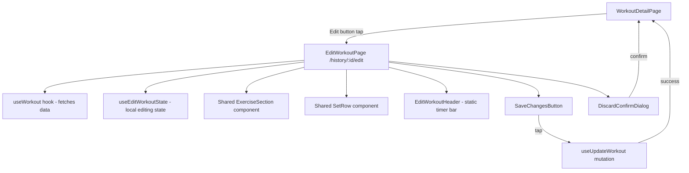
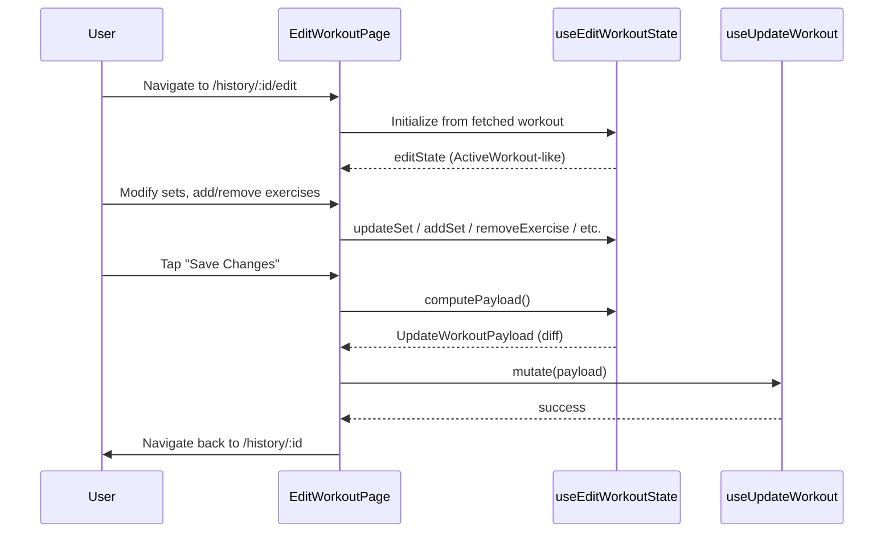

# Design Document: Unified Workout Edit

## Overview

The Unified Workout Edit feature introduces an `EditWorkoutPage` at `/history/:id/edit` that reuses the same component layout and interaction patterns as the existing `ActiveWorkoutPage`. Instead of building a parallel edit mode inside `WorkoutDetailPage` (which currently has a complex custom implementation), users navigate to a dedicated page that feels identical to logging a live workout — with the key differences being a static duration display (no running timer), all sets pre-marked as completed, and a "Save Changes" button in place of "Finish Workout."

The approach is to create a lightweight page-level wrapper (`EditWorkoutPage`) that:
1. Fetches the saved workout via the existing `useWorkout` hook.
2. Converts it into an in-memory editing state structurally identical to `ActiveWorkout`.
3. Renders the same `ExerciseSection` and `SetRow` inline components (extracted to shared components) with minor prop differences (no complete/uncomplete toggle, static timer).
4. On save, diffs the editing state against the original and calls `useUpdateWorkout` with the computed payload.

This keeps the UI code DRY, eliminates the dual-implementation maintenance burden, and gives users a single mental model for workout interaction.

## Architecture



### Data Flow



## Components and Interfaces

### New Components

| Component | Location | Responsibility |
|-----------|----------|----------------|
| `EditWorkoutPage` | `src/pages/EditWorkoutPage.tsx` | Page-level orchestrator; fetches data, manages edit state, handles save/discard |
| `EditWorkoutHeader` | Inline in `EditWorkoutPage` | Static header bar mirroring `WorkoutTimerBar` — shows workout name (editable), static duration, menu button |
| `SaveChangesButton` | Inline in `EditWorkoutPage` | Primary action button with loading/disabled states |

### Reused Components (from ActiveWorkoutPage)

The `ExerciseSection` and `SetRow` components are currently defined inline inside `ActiveWorkoutPage.tsx`. To share them, they will be extracted into:

| Component | New Location |
|-----------|--------------|
| `ExerciseSection` | `src/components/workout/ExerciseSection.tsx` |
| `SetRow` | Already exists at `src/components/workout/SetRow.tsx` — but the ActiveWorkoutPage has its own inline version. The inline version will be consolidated. |

The extracted `ExerciseSection` will accept a `mode` prop:

```typescript
interface ExerciseSectionProps {
  exercise: ActiveWorkoutExercise;
  index: number;
  total: number;
  mode: 'active' | 'edit';
  onUpdate: (exerciseId: string, setId: string, data: Partial<ActiveSet>) => void;
  onComplete?: (exerciseId: string, setId: string) => void;  // only in active mode
  onUncomplete?: (exerciseId: string, setId: string) => void; // only in active mode
  onAddSet: (exerciseId: string) => void;
  onDeleteSet: (exerciseId: string, setId: string) => void;
  onRemove: (exerciseId: string) => void;
  onRestDurationChange?: (exerciseId: string, seconds: number) => void; // only in active mode
  onMoveUp: () => void;
  onMoveDown: () => void;
}
```

In `edit` mode:
- The complete/uncomplete toggle button is hidden (sets are always shown as completed).
- The rest timer duration picker is hidden.
- The `onComplete`/`onUncomplete` callbacks are not called.

### Custom Hook: `useEditWorkoutState`

```typescript
interface UseEditWorkoutStateReturn {
  /** The mutable editing state, structured like ActiveWorkout */
  editState: ActiveWorkout | null;
  /** Whether any changes exist relative to the original */
  isDirty: boolean;
  /** Whether the state is still loading from the fetched workout */
  isLoading: boolean;
  
  // Mutations
  updateWorkoutName: (name: string) => void;
  addExercise: (exercise: { id: string; name: string; exerciseType: ExerciseType }) => void;
  removeExercise: (exerciseId: string) => void;
  reorderExercises: (fromIndex: number, toIndex: number) => void;
  addSet: (exerciseId: string) => void;
  deleteSet: (exerciseId: string, setId: string) => void;
  updateSet: (exerciseId: string, setId: string, data: Partial<ActiveSet>) => void;

  /** Computes the diff payload for useUpdateWorkout */
  computePayload: () => UpdateWorkoutPayload;
}
```

This hook:
1. Accepts the fetched `WorkoutWithExercises` and converts it to `ActiveWorkout` shape on first load.
2. Tracks the original snapshot for dirty-checking and diff computation.
3. All sets are initialized with `completed: true`.
4. New sets added by the user are also `completed: true` by default.

### Routing

Add a new route inside the `AppShell` protected routes:

```tsx
<Route path="/history/:id/edit" element={<EditWorkoutPage />} />
```

The `WorkoutDetailPage` "Edit" button will change from toggling an inline edit mode to navigating: `navigate(\`/history/${id}/edit\`)`.

## Data Models

No new database tables or columns. The feature uses existing tables:
- `workouts` (name updates)
- `workout_exercises` (add/delete/reorder)
- `exercise_sets` (add/delete/update values)

### Edit State Shape

The editing state reuses `ActiveWorkout` from `src/types/index.ts`:

```typescript
interface ActiveWorkout {
  id: string;
  routineId: string | null;
  name: string;
  startedAt: string;       // preserved, read-only in edit mode
  isPaused: boolean;       // irrelevant in edit mode
  elapsedSeconds: number;  // irrelevant in edit mode (static display)
  exercises: ActiveWorkoutExercise[];
}
```

The `startedAt` and `completedAt` from the original workout are preserved in the header for display and are never mutated or sent in the update payload.

### Diff Computation

The `computePayload()` function produces an `UpdateWorkoutPayload` by comparing editState to the original snapshot:

| Change Type | Detection | Payload Field |
|-------------|-----------|---------------|
| Name changed | `editState.name !== original.name` | `name` |
| Set values changed | Deep-compare set fields | `sets: UpdateSetPayload[]` |
| Sets deleted | Original set IDs missing from editState | `deleteSets: string[]` |
| Sets added | editState set IDs not in original | `addSets: AddSetPayload[]` |
| Exercises deleted | Original exercise IDs missing | `deleteExercises: string[]` |
| Exercises added | editState exercise IDs not in original | `addExercises: AddExercisePayload[]` |
| Exercises reordered | Position values differ | Handled by delete + re-add with new positions, or a dedicated position update |

## Correctness Properties

*A property is a characteristic or behavior that should hold true across all valid executions of a system — essentially, a formal statement about what the system should do. Properties serve as the bridge between human-readable specifications and machine-verifiable correctness guarantees.*

### Property 1: Timestamp Preservation

*For any* saved workout with timestamps `started_at`, `completed_at`, and `duration_seconds`, after any sequence of edits and a successful save, the resulting workout record SHALL have identical `started_at`, `completed_at`, and `duration_seconds` values.

**Validates: Requirements 2.1, 2.2, 2.3**

### Property 2: Edit State Initialization Round-Trip

*For any* valid `WorkoutWithExercises` object returned by the API, converting it to `ActiveWorkout` editing state and then computing the update payload without making any modifications SHALL produce an empty/no-op payload (no changes detected).

**Validates: Requirements 1.2, 9.1**

### Property 3: Set Deletion Renumbering

*For any* exercise with N sets (N ≥ 2), deleting any set at position K SHALL result in remaining sets being renumbered 1 through N-1 sequentially with no gaps.

**Validates: Requirements 5.2**

### Property 4: Exercise Reorder Integrity

*For any* list of exercises of length N, reordering exercise at index `from` to index `to` SHALL result in a permutation where all original exercises are present, no exercises are duplicated, and positions are sequential from 0 to N-1.

**Validates: Requirements 4.4**

### Property 5: Dirty State Detection

*For any* edit state, if and only if at least one field differs from the original snapshot (name, set values, set count, exercise list, or exercise order), then `isDirty` SHALL be `true`. If no field differs, `isDirty` SHALL be `false`.

**Validates: Requirements 7.4, 7.1**

### Property 6: New Sets Default to Completed

*For any* exercise in edit mode, when a new set is added, that set's `completed` field SHALL be `true`.

**Validates: Requirements 9.2**

## Error Handling

| Scenario | Behavior |
|----------|----------|
| Workout fetch fails (network error, 404) | Show error state with retry button. Do not render edit UI. |
| Save mutation fails | Show inline error toast/banner. Keep user on EditWorkoutPage with all edits intact. Do not navigate away. |
| User navigates away with unsaved changes (back button, browser nav) | Show `DiscardConfirmDialog`. Only navigate if confirmed. |
| Workout ID doesn't belong to current user | `useWorkout` returns empty/error due to RLS. Show "not found" state. |
| Concurrent edit (rare, single-user app) | Last-write-wins. No optimistic locking needed for this MVP. |

## Testing Strategy

### Property-Based Tests (using `fast-check`)

Each correctness property above will be implemented as a property-based test with a minimum of 100 iterations:

- **Property 1**: Generate random workout objects with timestamps, run through edit state init + save payload computation, assert timestamps are never included in the mutation payload.
- **Property 2**: Generate random `WorkoutWithExercises` structures, convert to edit state, compute payload, assert payload is empty.
- **Property 3**: Generate exercises with 2–10 sets, delete a random set, assert sequential renumbering.
- **Property 4**: Generate exercise lists of length 2–20, pick random from/to indices, assert valid permutation.
- **Property 5**: Generate edit states with random modifications (or none), assert `isDirty` matches actual diff.
- **Property 6**: Generate exercises, add sets, assert `completed === true`.

Tag format: `Feature: unified-workout-edit, Property N: <description>`

### Unit Tests (example-based)

- EditWorkoutHeader renders static duration in `HH:MM:SS` format
- SaveChangesButton shows loading spinner when mutation is pending
- DiscardConfirmDialog appears only when `isDirty` is true
- ExercisePicker integration: selected exercise appends to list with one empty completed set
- ExerciseSection in `edit` mode hides complete/uncomplete toggle

### Integration Tests

- Full save flow: navigate to edit page → modify a set → tap save → verify `useUpdateWorkout` called with correct payload → verify navigation to detail page
- Discard flow: modify → tap back → confirm discard → verify navigation without save
- Route guard: navigating to `/history/:id/edit` with invalid ID shows error state
